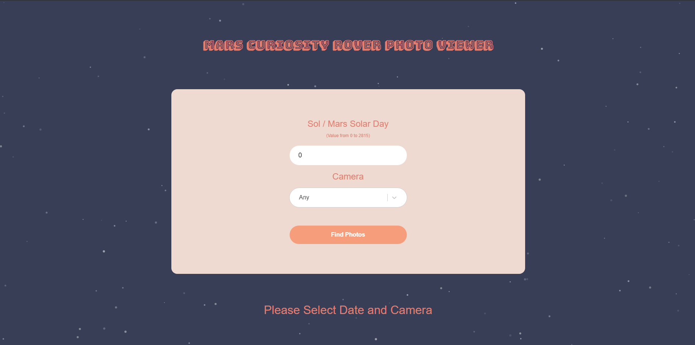

# Mars Curiosity Rover Photos Viewer

A web app to search and view photos taken by curiosity rover.

[Live Demo](https://tender-noether.netlify.app/)

## Preview



## Features

- Search Photos taken by Curiosity Rover
- Search by Sol (Mars Solar Day from the landing date)
- Filter by Camera type
- Fully Responsive Design

## Pre-requisites

Make Sure you have installed the following on your development machine:

- Node.js - [Download & install Node.js](https://nodejs.org/en/download/) and npm package manager.
- Neltify - You're going to use nelify-cli to manage serverless functions. Make sure you've installed Node.js and npm first, then install nelify-cli globally using npm:

```
$ npm install netlify-cli -g
```

## Dev Setup

1. Cloning the git repository

```
$ git clone https://github.com/fyrepenguin/curiosity-photos.git
```

2. Get API key from [nasa open api](https://api.nasa.gov/index.html#apply-for-an-api-key)
3. Create a .env file in the project root folder and add the key you got from nasa as

```
API_KEY=YOUR_API_KEY
```

4. Go the project root directory in termninal &
   install all the packages necessary using:

```
$ npm install
```

Run the following two commands **concurrently** in 2 seperate terminal windows.

1. To start front-end application:

```
$ npm start
```

2. To serve functions:

```
$ npm run start:lambda
```

## Tech stack used

- [React](https://reactjs.org/)
- [Netlify](https://docs.netlify.com/)

## Deployment

You can deploy from github using netlify [automatically](https://www.netlify.com/blog/2016/09/29/a-step-by-step-guide-deploying-on-netlify/) or you can use netlify-cli to deploy [manually](https://www.netlify.com/blog/2019/05/28/deploy-in-seconds-with-netlify-cli/)
